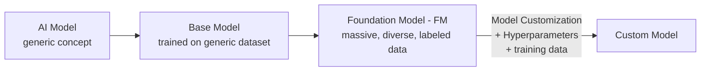
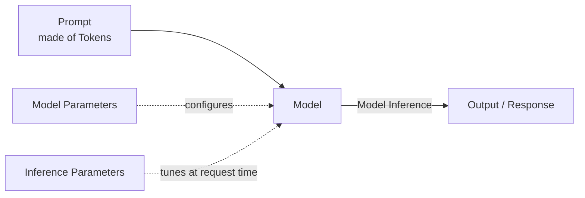
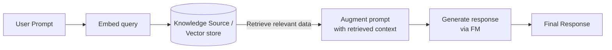

# AWS Tutorial - Amazon Bedrock - Terminology

**Playlist position:** #1 of 86
**Category:** Tutorials & Overviews
**YouTube:** https://youtu.be/PKm162ZcbP4
**Duration:** ~19:39
**Channel:** NamrataHShah

---

## TL;DR
- Amazon Bedrock's vocabulary builds up in a chain: **AI Model → Base Model → Foundation Model (FM) → Custom Model**.
- A model takes a **Prompt** (made of **Tokens**), runs **Model Inference**, and produces a response — this behavior is tuned by **Model Parameters** / **Inference Parameters**.
- **Embeddings** turn data into numeric vectors so similarity/difference can be computed — this is the backbone of **RAG** (Retrieval Augmented Generation).
- **Orchestration** coordinates an FM + your data/apps to do a task; an **Agent** is the application that actually carries out that orchestration.
- **Model Customization** (tuned via **Hyperparameters**) turns a base/foundation model into a **Custom Model**; **Model Evaluation** checks if a model is the right fit; **Provisioned Throughput** is purchased capacity to process tokens faster for production workloads.

## Detailed Notes

### 1. AI Model
A mathematical/computational structure trained to recognize patterns in data and make decisions or predictions based on that data. This is the most generic term — everything below is a flavor of "AI model."

### 2. Base Model
An AI model built/developed by a provider (or by you), trained on a **generic dataset**. It's simple by design — it's the starting point used to build more capable models.

### 3. Foundation Model (FM)
An AI model with a **large number of parameters**, trained on **massive amounts of diverse (typically labeled) data**, able to generate responses as chat, text, or image.

> ⚠️ **Base Model vs. Foundation Model** — used interchangeably in casual conversation, but technically different:
> | | Base Model | Foundation Model |
> |---|---|---|
> | Training data | Generic dataset | Massive, diverse (often labeled) dataset |
> | Role | Starting point / building block | What you actually consume & build apps on |
> | Relationship | A base model is the foundation *used to create* an FM | Built from one or more base models |

### 4. Model Inference
The process of a foundation model generating an output/response from a given input/prompt. "Inference" = reaching a conclusion — the model runs its internal computations on your input and produces a conclusion (the output).

### 5. Prompt
The input provided to a model so it can generate a corresponding response/output. (See the separate [Prompt Engineering](https://www.youtube.com/watch?v=?) material — prompt design becomes more critical as you go deeper into AI.)

### 6. Token
A sequence of characters that a model interprets as a **single unit** (analogous to a byte being a unit made of 8 bits). Every model publishes how many tokens it can process per request — a commonly seen number is **512**.

### 7. Model Parameters
Values that define a model and its behavior — how it interprets input and generates output/response. These are configured so input is processed, and output generated, in a specific way.

### 8. Inference Parameters
Values that can be adjusted **during model inference** (i.e., at request time) to influence the final output/response — distinct from model parameters, which define the model itself.

### 9. Playground
The GUI interface inside the AWS Management Console used to experiment with, learn, and familiarize yourself with Amazon Bedrock and its foundation models — no code required.

### 10. Embedding
The process of condensing information and transforming it into a **vector** (a set of numerical values). Numbers are easy to compare, so embeddings let you measure **similarity or difference** between objects (text, documents, etc.) numerically.

- Typically used when comparing documents/files or building a knowledge base: a question is embedded, compared against embedded documents, and the closest match is where the answer is retrieved from.
- Behind the scenes it's far more complex, but conceptually: **embedding = numerical vector representation of data**, used to measure similarity.

### 11. Orchestration
The process of coordinating between a foundation model and your enterprise data/applications in order to carry out a task.

### 12. Agent
An application that carries out orchestration — interpreting inputs and producing outputs using a foundation model. You can put your own GUI/app on top, but that app calls an agent, and the agent drives the FM + orchestration underneath.

### 13. RAG (Retrieval Augmented Generation)
The process of **querying and retrieving** information from a data source in order to **augment** a generated response.

- **Retrieval** — the model retrieves relevant data (often via embeddings/vector similarity) for your prompt.
- **Augmented** — the response is adjusted/enriched using that retrieved data.
- **Generation** — the final response is generated.

Every word in the acronym pulls its weight: retrieve data → augment the response with it → generate the final output.

### 14. Model Customization
The process of using **training data** to adjust **model parameter values** in order to create a **custom model**.

### 15. Hyperparameters
Values that can be adjusted **for model customization** to control the training process — and consequently, the output of the resulting custom model. (Hyperparameters tune *training*; inference parameters tune *inference-time* output.)

### 16. Model Evaluation
The process of comparing/evaluating models to determine the right fit for your use case — does it give accurate, relevant responses for your specific prompts and needs? Usually involves testing multiple models side by side.

### 17. Provisioned Throughput
**Purchased throughput** for a model (base, foundation, or custom) to increase the **rate of tokens processed** during model inference — needed when a commercial application can't tolerate the default response speed/volume. In short: you pay for faster/higher-volume token processing.

## Diagrams

**Model lineage — how a Base Model becomes a Custom Model**

**Prompt → Inference → Response pipeline**

**RAG — Retrieval Augmented Generation flow**

🔗 **Interactive version:** see the [Terminology demo](../../docs/01-terminology/index.html) — clickable glossary + an animated RAG step-through.

## Quick Revision Cheat-Sheet

| Term | One-line takeaway |
|---|---|
| AI Model | Math/computational structure trained to recognize patterns & predict |
| Base Model | AI model trained on a **generic** dataset — the starting point |
| Foundation Model (FM) | Large-parameter model trained on **massive, diverse** data |
| Model Inference | The act of taking input → processing → producing output |
| Prompt | The input given to a model |
| Token | Smallest unit of text a model processes (often ~512 tokens/request) |
| Model Parameters | Values defining the model itself & its behavior |
| Inference Parameters | Values tuned at request time to shape the output |
| Playground | AWS console GUI to experiment with Bedrock models, no code |
| Embedding | Data → numeric vector, used to measure similarity/difference |
| Orchestration | Coordinating FM + enterprise data/apps to complete a task |
| Agent | The app that performs orchestration using an FM |
| RAG | Retrieve data → augment prompt/response → generate final output |
| Model Customization | Use training data to adjust model parameters → custom model |
| Hyperparameters | Values tuned **during training/customization**, not at inference |
| Model Evaluation | Compare models to find the best fit for your use case |
| Provisioned Throughput | Purchased capacity for faster/higher-volume token processing |

## Interview Q&A

**Q: What's the difference between a base model and a foundation model?**
A: A base model is trained on a generic dataset and acts as the starting point; a foundation model has far more parameters and is trained on massive, diverse (often labeled) data. In practice people use the terms loosely, but technically a base model is used to *build* a foundation model.

**Q: What is model inference, concretely?**
A: The end-to-end process where a model takes your prompt as input, runs it through its internal computations, and produces an output/response — i.e., reaches a "conclusion."

**Q: How is a hyperparameter different from an inference parameter?**
A: Hyperparameters control the **training/customization** process (and so shape the resulting custom model). Inference parameters are adjusted **at request time** to influence a single response, without retraining anything.

**Q: Explain RAG in one sentence.**
A: RAG retrieves relevant external data (usually via embedding similarity), uses it to augment the prompt/response, and generates the final output — so the model answers using information beyond its own training data.

**Q: Why would you buy Provisioned Throughput?**
A: Default token-processing speed/volume may not be enough for a commercial application with high request volume or latency requirements — provisioned throughput is purchased capacity to raise the rate of tokens a model (base, FM, or custom) can process during inference.

**Q: What's the relationship between an Agent and Orchestration?**
A: Orchestration is the *process* of coordinating an FM with your data/applications to complete a task. An Agent is the *application* that actually executes that orchestration — interpreting inputs and producing outputs via the FM.

## References
- AWS docs: [Key definitions for Amazon Bedrock](https://docs.aws.amazon.com/bedrock/latest/userguide/key-definitions.html)
- [Interactive terminology demo](../../docs/01-terminology/index.html)

## Status / Navigation
- ⬅️ Previous: — (first video)
- ➡️ Next: [AWS Tutorial - Amazon Bedrock - Overview](../02-overview/README.md)

---
_Part of [AWS Bedrock Learnings](../../README.md)._
