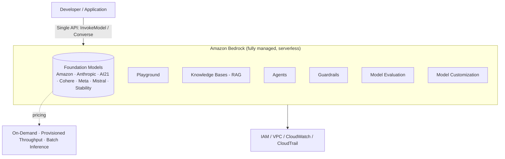

# AWS Tutorial - Amazon Bedrock - Overview

**Playlist position:** #2 of 86
**Category:** Tutorials & Overviews
**YouTube:** https://www.youtube.com/watch?v=F3y9YcQHa7Q
**Duration:** ~16:58
**Channel:** NamrataHShah

---

## TL;DR
- Amazon Bedrock is a **fully managed, serverless** service that gives you a single API to access foundation models from **multiple providers** (Amazon, Anthropic, AI21 Labs, Cohere, Meta, Mistral AI, Stability AI, and others) without managing any infrastructure.
- Beyond raw model access, Bedrock bundles the tooling around an FM: **Playground**, **Knowledge Bases (RAG)**, **Agents**, **Guardrails**, **Model Evaluation**, **Model Customization**, and **Provisioned Throughput**.
- You only pay for what you use — primarily **On-Demand** (per-token) pricing, with **Provisioned Throughput** and **Batch Inference** as alternative pricing/consumption modes for production or large-batch workloads.
- Core use cases: chat/conversational assistants, summarization, Q&A over your own documents (RAG), content generation, code generation, and agentic task automation.

## Detailed Notes

### Introduction & setup
Amazon Bedrock is accessed through the **AWS Management Console** (search "Bedrock"), the AWS CLI, or any AWS SDK. Before using a model, you must **request access** to it under *Model access* in the console — this is a one-time, per-region, per-model approval step (instant for most models, a short form for a few).

### What Amazon Bedrock is
Bedrock is a **fully managed, serverless** service — there are no servers, clusters, or GPUs to provision or scale. It exposes a **single, consistent API** (the `InvokeModel` / `Converse` APIs) that works across foundation models from multiple providers, so switching models is a configuration change, not a rewrite. AWS handles hosting, scaling, and availability of the underlying models.

Because it sits inside your AWS account, Bedrock also inherits standard AWS primitives for free: **IAM** for access control, **VPC** endpoints for private networking, **CloudWatch/CloudTrail** for logging and monitoring, and **encryption** (in transit and at rest) by default.

### Supported foundation models
Bedrock offers models from several providers side by side, so you can pick the best model per task rather than being locked into one vendor:
- **Amazon** — Titan (text, embeddings, image) and Nova (text, multimodal, including agentic use cases)
- **Anthropic** — Claude family
- **AI21 Labs**, **Cohere**, **Meta** (Llama), **Mistral AI**, **Stability AI** (image generation), and more added over time

Models differ in modality (text, image, embeddings), context window, pricing, and region availability — always check the current supported-models and region-availability docs before committing to one (see References below), since this list changes frequently.

### Key use cases
- **Conversational assistants / chatbots** — using Converse/InvokeModel directly, or via Agents for multi-step tasks
- **Summarization & content generation** — marketing copy, reports, document summaries
- **Q&A over private data (RAG)** — via **Knowledge Bases**, grounding responses in your own documents instead of only the model's training data
- **Search & classification** — using **embeddings** models for semantic search
- **Code generation / developer assistance**
- **Agentic automation** — using **Agents** to orchestrate multi-step workflows against your APIs/data
- **Responsible-AI guardrails** — filtering harmful content, PII, or off-topic responses via **Guardrails**, independent of which model is used

### Pricing and tools
Bedrock's pricing model has three main shapes:
1. **On-Demand** — pay per input/output token (or per image), no commitment; best for variable or low-to-medium traffic.
2. **Provisioned Throughput** — purchase a fixed hourly capacity (measured in model units) for consistent, high-throughput, low-latency production workloads; required for some custom models.
3. **Batch Inference** — submit a large batch of prompts for asynchronous processing at a discounted rate when you don't need a real-time response.

Beyond raw inference, the console exposes supporting tools you'll meet in later videos: the **Playground** (interactive testing), **Knowledge Bases**, **Agents**, **Guardrails**, **Prompt Management/Flows**, **Model Evaluation**, and **Model Customization** (fine-tuning, continued pre-training, distillation).

## Diagram

## Quick Revision Cheat-Sheet

| Concept | One-line takeaway |
|---|---|
| Bedrock | Fully managed, serverless, single API to multiple providers' FMs |
| Model access | One-time per-region/per-model approval before you can invoke a model |
| Providers | Amazon, Anthropic, AI21, Cohere, Meta, Mistral, Stability (+more over time) |
| On-Demand pricing | Pay per token/image, no commitment |
| Provisioned Throughput | Purchased hourly capacity for consistent production throughput |
| Batch Inference | Discounted, asynchronous processing for large prompt batches |
| Knowledge Bases | Built-in RAG — ground responses in your own data |
| Agents | Orchestrate multi-step tasks against your APIs/data using an FM |
| Guardrails | Model-agnostic safety/content filtering layer |

## Interview Q&A

**Q: What makes Amazon Bedrock "serverless"?**
A: There's no infrastructure to provision, patch, or scale — you call an API (`InvokeModel`/`Converse`) and AWS handles hosting and scaling of the underlying foundation model. You pay per use rather than for idle capacity (except under Provisioned Throughput, which is a deliberate capacity purchase).

**Q: Why would you choose Provisioned Throughput over On-Demand?**
A: On-Demand is pay-per-token with no latency/throughput guarantees, suitable for variable traffic. Provisioned Throughput reserves dedicated capacity for predictable, high-volume, low-latency production traffic — and it's required for invoking certain custom/fine-tuned models.

**Q: How does Bedrock let you support multiple model providers without rewriting your app?**
A: It exposes one common API surface (e.g., the `Converse` API) across providers; switching the `modelId` is largely enough to swap providers, instead of integrating each vendor's own SDK/API.

**Q: Where would Guardrails vs. Knowledge Bases fit in an architecture?**
A: Knowledge Bases grounds the model's answers in your own data (RAG) to improve accuracy/relevance. Guardrails is an independent policy layer that filters inputs/outputs (harmful content, PII, denied topics) regardless of which model or data source is used — the two are complementary, not alternatives.

## References
- AWS docs: [What is Amazon Bedrock?](https://docs.aws.amazon.com/bedrock/latest/userguide/what-is-bedrock.html)
- AWS docs: [Supported foundation models in Amazon Bedrock](https://docs.aws.amazon.com/bedrock/latest/userguide/models-supported.html)

## Status / Navigation
- ⬅️ Previous: [Terminology](../01-terminology/README.md)
- ➡️ Next: [Chat with your document](../../02-hands-on-labs/01-chat-with-your-document/README.md)

---
_Part of [AWS Bedrock Learnings](../../README.md)._
