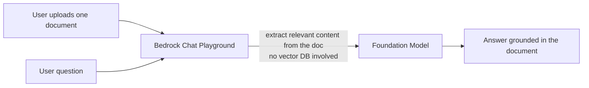

# Hands on lab - Amazon Bedrock - Chat with your document

**Playlist position:** #3 of 86
**Category:** Hands-on Labs
**YouTube:** https://www.youtube.com/watch?v=a7HOtyD7Hjc
**Duration:** ~20:02
**Channel:** NamrataHShah

---

## TL;DR
- **"Chat with your document"** is a lightweight, **infrastructure-free RAG** mode inside the Bedrock console's chat playground — you upload a single file and ask questions about it, no Knowledge Base, vector store, or embeddings pipeline required.
- It's session-scoped: the document is used as context for that conversation only and isn't persisted or indexed anywhere.
- It's the fastest way to test "does RAG help here?" before investing in a full **Knowledge Base** (used when you need to query many documents continuously — see [Video 4](../02-knowledge-bases/README.md)).

## Detailed Notes

### What it is
Inside the Bedrock console's **Chat / Text playground**, there's a **"Chat with your document"** toggle. Turning it on lets you attach a single file (PDF, TXT, DOCX, CSV, MD, HTML, etc., up to a size limit) directly to the conversation. Behind the scenes, Bedrock extracts the document's content and feeds relevant parts of it into the model's context alongside your question — a one-off, ad-hoc form of Retrieval-Augmented Generation (RAG) that needs **zero setup**.

### How it differs from a full Knowledge Base
| | Chat with your document | Knowledge Base (Video 4) |
|---|---|---|
| Setup | None — upload in the console and go | S3 data source, embeddings model, vector store (OpenSearch Serverless/Aurora/Pinecone/etc.), sync job |
| Scope | One document, one session | Many documents, continuously queryable |
| Persistence | Not stored/indexed | Indexed and reusable across sessions/apps |
| Best for | Quick exploration, one-off Q&A, demos | Production RAG over a growing document corpus |

### Console walkthrough (high level)
1. Open **Amazon Bedrock → Playgrounds → Chat / Text**.
2. Pick a foundation model that supports document chat (most current-generation chat models do).
3. Toggle **"Chat with your document"**.
4. Upload the file (watch the size/format limits shown in the console).
5. Ask natural-language questions — the model answers grounded in the uploaded document's content, and you can keep following up within the same session.

### Why it matters
This feature removes the two biggest blockers to trying RAG — picking/configuring a vector store and building an ingestion pipeline — so you can validate the *prompting and model-choice* side of a RAG use case before committing to the infrastructure of a real Knowledge Base.

## Diagram

## Quick Revision Cheat-Sheet

| Term | One-line takeaway |
|---|---|
| Chat with your document | Console toggle to RAG over a single uploaded file, no infra |
| Scope | Session-only — not indexed, not reusable elsewhere |
| vs. Knowledge Base | KB = many docs, persistent, production-grade; this = one doc, ad-hoc |
| Best use | Quickly validate a RAG idea before building a full Knowledge Base |

## Interview Q&A

**Q: How is "Chat with your document" different from a Bedrock Knowledge Base?**
A: It needs no setup — no S3 data source, embeddings model, or vector store — because it works on a single uploaded document for just that chat session. A Knowledge Base ingests and indexes many documents into a vector store so they can be queried repeatedly across sessions and applications.

**Q: When would you use this feature in a real project?**
A: For quick exploration — confirming a model can answer well from a given document's content — before investing engineering effort into standing up a full Knowledge Base pipeline.

## References
- AWS docs: [Chat with your document data and no data source attached](https://docs.aws.amazon.com/bedrock/latest/userguide/knowledge-base-chatdoc.html)

## Status / Navigation
- ⬅️ Previous: [Overview](../../01-tutorials-overview/02-overview/README.md)
- ➡️ Next: [Knowledge Bases](../02-knowledge-bases/README.md)

---
_Part of [AWS Bedrock Learnings](../../README.md)._
