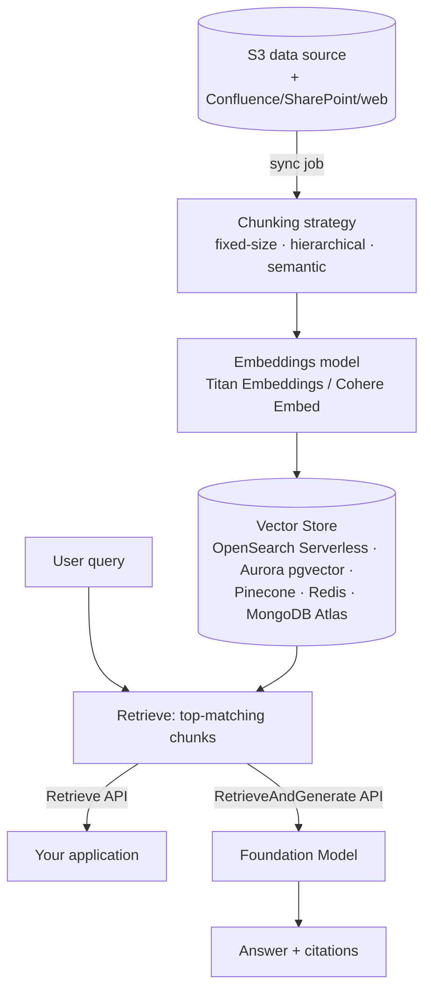

# Hands on lab - Amazon Bedrock - Knowledge Bases

**Playlist position:** #4 of 86
**Category:** Hands-on Labs
**YouTube:** https://www.youtube.com/watch?v=aUsy65u9sbE
**Duration:** ~43:23
**Channel:** NamrataHShah

---

## TL;DR
- A **Knowledge Base** is Bedrock's managed **RAG pipeline**: point it at a data source (typically S3), it chunks + embeds your documents into a vector store, and your app queries it via `Retrieve` or `RetrieveAndGenerate` APIs (or straight from the console).
- You choose the pieces: **data source**, **chunking strategy**, **embeddings model**, and **vector store** (OpenSearch Serverless, Aurora PostgreSQL/pgvector, Pinecone, Redis Enterprise Cloud, MongoDB Atlas).
- `RetrieveAndGenerate` does the whole RAG loop for you (retrieve chunks → augment prompt → generate answer) and can return **citations** pointing back to the source chunks.

## Detailed Notes

### What a Knowledge Base is
A Knowledge Base is Bedrock's implementation of the full [RAG](../../01-tutorials-overview/01-terminology/README.md) pattern as a managed service: it ingests documents from a **data source**, splits them into chunks, converts each chunk into an **embedding** (a numeric vector) using an embeddings model, and stores those vectors in a **vector store**. At query time it retrieves the chunks most similar to the user's question and either returns them raw (`Retrieve`) or feeds them to a foundation model to produce a grounded answer (`RetrieveAndGenerate`).

### Building blocks
1. **Data source** — most commonly an **S3 bucket** (also supports Confluence, Salesforce, SharePoint, and web crawlers). You point the Knowledge Base at a bucket/prefix containing your documents.
2. **Chunking strategy** — how documents are split before embedding:
   - *Fixed-size chunking* — split into roughly equal token-sized chunks with configurable overlap.
   - *Hierarchical chunking* — parent/child chunks, so retrieval can return a focused child chunk but the model sees the fuller parent context.
   - *Semantic chunking* — splits at natural topic boundaries rather than fixed sizes.
   - *No chunking / custom chunking* — e.g. via a Lambda transformation if you want full control.
3. **Embeddings model** — e.g. **Amazon Titan Embeddings** or **Cohere Embed** — converts each chunk (and later each query) into a vector.
4. **Vector store** — where the embeddings live. Bedrock can auto-provision **Amazon OpenSearch Serverless**, or you can bring your own: **Aurora PostgreSQL (pgvector)**, **Pinecone**, **Redis Enterprise Cloud**, or **MongoDB Atlas**.
5. **Sync** — ingestion is not automatic on every file change; you (or a trigger) run a **sync job** to re-crawl the data source and refresh the vector store.

### Querying a Knowledge Base
- **`Retrieve`** — returns the top-matching raw chunks for a query (you handle prompting/generation yourself).
- **`RetrieveAndGenerate`** — does retrieval *and* calls a foundation model to generate a final answer in one call; can include **citations** referencing which source chunks backed the answer.
- You can also test a Knowledge Base directly from the **Bedrock console chat playground** by selecting it as a data source, without writing any code.

### Why Knowledge Bases over "Chat with your document"
Compared to the single-document, session-only mode from [Video 3](../01-chat-with-your-document/README.md), a Knowledge Base: scales to many documents, persists across sessions and applications, supports incremental updates via sync, and is the pattern you'd actually put behind a production chatbot or search feature.

## Diagram

## Quick Revision Cheat-Sheet

| Term | One-line takeaway |
|---|---|
| Data source | Where documents live — usually S3 (also Confluence/SharePoint/web) |
| Chunking | Fixed-size, hierarchical, or semantic splitting before embedding |
| Embeddings model | Converts chunks/queries into vectors (e.g., Titan Embeddings) |
| Vector store | OpenSearch Serverless (default) or bring-your-own (Aurora/Pinecone/Redis/MongoDB) |
| Sync job | Manual/triggered re-ingestion to refresh the vector store |
| Retrieve | Returns raw matching chunks only |
| RetrieveAndGenerate | Full RAG in one call: retrieve + augment + generate, with citations |

## Interview Q&A

**Q: Walk through what happens when you create and query a Bedrock Knowledge Base.**
A: You connect a data source (e.g. S3), choose a chunking strategy and embeddings model, and pick/provision a vector store. A sync job chunks and embeds the documents into that store. At query time, `Retrieve` fetches the closest-matching chunks by vector similarity, and `RetrieveAndGenerate` additionally passes those chunks to a foundation model to produce a cited, grounded answer.

**Q: What's the difference between `Retrieve` and `RetrieveAndGenerate`?**
A: `Retrieve` only returns the matching source chunks — you own the prompting/generation step. `RetrieveAndGenerate` performs the entire RAG pipeline for you in one API call and can return citations pointing to the source chunks used.

**Q: Why might you choose hierarchical chunking over fixed-size chunking?**
A: Fixed-size chunking can cut context awkwardly mid-thought. Hierarchical chunking retrieves a precise, small child chunk (good for matching relevance) while still giving the model its larger parent chunk as context (good for coherent answers).

**Q: Does updating a file in S3 automatically update the Knowledge Base?**
A: No — you need to run (or trigger) a **sync job** to re-crawl the data source and refresh the vector store; ingestion isn't automatic on every change.

## References
- AWS docs: [Knowledge bases for Amazon Bedrock](https://aws.amazon.com/bedrock/knowledge-bases/)
- AWS docs: [Supported Regions and models for Knowledge Bases](https://docs.aws.amazon.com/bedrock/latest/userguide/models-regions.html)
- AWS docs: [Retrieve data and generate AI responses with knowledge bases](https://docs.aws.amazon.com/bedrock/latest/userguide/knowledge-base.html)

## Status / Navigation
- ⬅️ Previous: [Chat with your document](../01-chat-with-your-document/README.md)
- ➡️ Next: [Guardrails](../03-guardrails/README.md)

---
_Part of [AWS Bedrock Learnings](../../README.md)._
