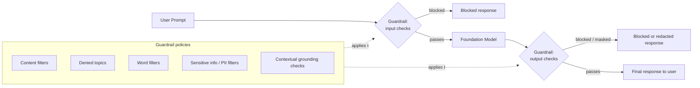

# Hands on lab - Amazon Bedrock - Guardrails

**Playlist position:** #5 of 86
**Category:** Hands-on Labs
**YouTube:** https://www.youtube.com/watch?v=NpR2fMtKQus
**Duration:** ~39:43
**Channel:** NamrataHShah

---

## TL;DR
- **Guardrails for Amazon Bedrock** is a **model-agnostic safety layer** you configure once and attach to any model, Agent, or Knowledge Base call — it inspects both the prompt and the response.
- You combine several policy types: **content filters**, **denied topics**, **word filters**, **sensitive information (PII) filters**, and **contextual grounding checks**.
- Guardrails can be tested independently via the **`ApplyGuardrail`** API without invoking any model at all, and are versioned so you can iterate on a draft before publishing.

## Detailed Notes

### What Guardrails is
Guardrails is a standalone, reusable policy configuration that sits **in front of and behind** a model call — it evaluates the user's prompt before it reaches the model, and the model's response before it reaches the user. Because it's independent of any specific FM, the same guardrail can be reused across different models, Agents, or Knowledge Bases.

### Policy types you can configure
1. **Content filters** — detect and block categories like *Hate*, *Insults*, *Sexual*, *Violence*, *Misconduct*, and **prompt-attack detection** (jailbreak/prompt-injection attempts). Each category has an independent strength: *None / Low / Medium / High*, settable separately for prompts vs. responses.
2. **Denied topics** — define topics in plain language (e.g., "investment advice") that the model should refuse to engage with, with example phrases to help it recognize the topic.
3. **Word filters** — block a custom list of specific words/phrases, plus a built-in profanity filter.
4. **Sensitive information filters (PII)** — detect and either **block** or **mask** built-in PII entity types (name, email, phone, SSN, credit card, etc.), plus custom **regex patterns** for domain-specific identifiers.
5. **Contextual grounding checks** — for RAG use cases: a *grounding* threshold (is the answer actually supported by the retrieved context?) and a *relevance* threshold (is the answer relevant to the question?) to reduce hallucination.

### Working with Guardrails in the console
1. **Amazon Bedrock → Guardrails → Create guardrail.**
2. Configure the policies above; each guardrail starts as a **working draft** you can iterate on.
3. Use **Guardrail test** in the console to send sample prompts/responses and see exactly which policy triggered (and at what strength).
4. **Create a version** once you're happy with the draft — versions are immutable snapshots you reference from your application.
5. Attach the guardrail to a model invocation by passing `guardrailIdentifier` + `guardrailVersion` (works with `InvokeModel`, `Converse`, Agents, and Knowledge Bases), or call it standalone via the **`ApplyGuardrail`** API to check arbitrary text without running a model at all.

### Why it matters
Guardrails decouples **safety/compliance policy** from **model choice** — you can swap the underlying FM without re-implementing content moderation, and the same policy enforces consistent behavior across every application that uses it.

## Diagram

## Quick Revision Cheat-Sheet

| Policy | What it does |
|---|---|
| Content filters | Hate/Insults/Sexual/Violence/Misconduct + prompt-attack detection, 4 strength levels |
| Denied topics | Plain-language topics the model must refuse |
| Word filters | Custom blocklist + built-in profanity filter |
| Sensitive info (PII) filters | Block or mask built-in PII types + custom regex |
| Contextual grounding checks | Grounding + relevance thresholds for RAG, reduces hallucination |
| `ApplyGuardrail` API | Test/apply a guardrail standalone, no model call needed |
| Guardrail version | Immutable snapshot of a working draft, referenced by apps |

## Interview Q&A

**Q: Is a Guardrail tied to a specific foundation model?**
A: No — it's model-agnostic. You configure it once and attach it (via `guardrailIdentifier`/`guardrailVersion`) to any model, Agent, or Knowledge Base call, so swapping the underlying model doesn't require re-implementing safety policy.

**Q: How would you reduce hallucination in a RAG chatbot using Guardrails?**
A: Enable **contextual grounding checks** and set grounding/relevance thresholds — responses that aren't sufficiently supported by the retrieved context, or that aren't relevant to the question, get filtered.

**Q: How can you test a Guardrail without calling a foundation model?**
A: Use the **`ApplyGuardrail`** API directly — it evaluates arbitrary input/output text against the guardrail's policies without invoking any model.

**Q: What's the difference between blocking and masking for PII?**
A: Blocking rejects the content outright when PII is detected; masking redacts just the detected PII (e.g., replacing an email with a placeholder) while letting the rest of the response through.

## References
- AWS docs: [Stop harmful content with Amazon Bedrock Guardrails](https://docs.aws.amazon.com/bedrock/latest/userguide/guardrails.html)
- AWS docs: [Supported foundation models in Amazon Bedrock](https://docs.aws.amazon.com/bedrock/latest/userguide/models-supported.html)
- AWS docs: [Model support by AWS Region](https://docs.aws.amazon.com/bedrock/latest/userguide/models-regions.html)

## Status / Navigation
- ⬅️ Previous: [Knowledge Bases](../02-knowledge-bases/README.md)
- ➡️ Next: [Watermark detection](../04-watermark-detection/README.md)

---
_Part of [AWS Bedrock Learnings](../../README.md)._
