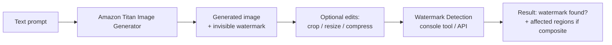

# Hands on lab - Amazon Bedrock - Watermark detection

**Playlist position:** #6 of 86
**Category:** Hands-on Labs
**YouTube:** https://www.youtube.com/watch?v=DyVnGzFb3Lw
**Duration:** ~8:54
**Channel:** NamrataHShah

---

## TL;DR
- Every image generated by **Amazon Titan Image Generator** carries an **invisible watermark** embedded by default — it doesn't change how the image looks, but it can be detected programmatically.
- Bedrock provides a **watermark detection** capability (console tool + API) that checks a given image and reports whether it was generated by Titan Image Generator, down to flagging watermarked sub-regions if the image was edited/cropped/combined.
- This is a **responsible-AI / provenance** feature — it helps verify whether an image is AI-generated, supporting content-authenticity and misinformation-mitigation efforts.

## Detailed Notes

### Why invisible watermarking exists
As generative image models make synthetic images harder to distinguish from real ones, provenance matters — for content moderation, journalism, platform policy, and simply knowing "was this AI-generated?" Amazon Titan Image Generator addresses this by embedding an **imperceptible digital watermark** into every image it creates, by default, at no extra action required from the caller.

### How detection works
- The watermark is designed to be **robust to common modifications** — cropping, resizing, compression, and some color adjustments — so a detector can still recognize a watermarked image (or watermarked region) after it's been edited or combined with other content.
- **Detection** is a separate step from generation: you feed a candidate image into the watermark detector, and it reports whether a Titan-embedded watermark was found, and — for composite images — can indicate *which regions* appear watermarked.
- This is available both in the **Bedrock console** (upload an image and run detection interactively) and programmatically via the **Bedrock API**, so it can be built into a content pipeline (e.g., auto-flagging AI-generated uploads).

### Why it matters
This pairs with [Guardrails](../03-guardrails/README.md) as part of Bedrock's responsible-AI toolkit — Guardrails controls what a model is allowed to say, while watermarking/detection addresses **provenance and authenticity** of what a model generates.

## Diagram

## Quick Revision Cheat-Sheet

| Concept | One-line takeaway |
|---|---|
| Invisible watermark | Embedded by default in every Titan Image Generator output |
| Robustness | Survives cropping/resizing/compression/basic edits |
| Watermark detection | Separate console/API step that checks an image for the watermark |
| Composite images | Detector can flag which regions are watermarked |
| Purpose | Content provenance / authenticity — part of responsible AI |

## Interview Q&A

**Q: Do you need to do anything extra to get a watermark on Titan-generated images?**
A: No — it's embedded automatically and invisibly on every image Titan Image Generator produces; there's no opt-in step at generation time.

**Q: How would you use watermark detection in a real application?**
A: Call the detection API as part of a content-moderation or upload pipeline to automatically flag images that were AI-generated by Titan, e.g. for platform disclosure requirements or misinformation checks.

**Q: Does editing an image remove the watermark?**
A: Not necessarily — the watermark is designed to survive common modifications like cropping, resizing, and compression, and detection can even identify watermarked sub-regions within a composite/edited image.

## References
- AWS: [Watermark detection for images generated by Amazon Titan Image Generator](https://aws.amazon.com/about-aws/whats-new/2024/04/watermark-detection-amazon-titan-image-generator-bedrock)

## Status / Navigation
- ⬅️ Previous: [Guardrails](../03-guardrails/README.md)
- ➡️ Next: [Prompt Routers - Preview](../../03-prompt-management/01-prompt-routers-preview/README.md)

---
_Part of [AWS Bedrock Learnings](../../README.md)._
