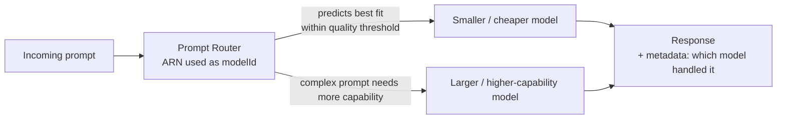

# Amazon Bedrock - Prompt Routers - Preview

**Playlist position:** #7 of 86
**Category:** Prompt Management
**YouTube:** https://www.youtube.com/watch?v=vujzWUaBkHI
**Duration:** ~12:47
**Channel:** NamrataHShah

---

## TL;DR
- **Intelligent Prompt Routing** dynamically sends each request to the best model **within a chosen model family** (e.g., different tiers of the same model line), predicting which tier can handle that specific prompt well enough — balancing **cost vs. response quality** automatically, per request.
- You either use an AWS-provided **default prompt router** or create a **custom** one by picking the candidate models and a **response-quality-difference threshold** you're willing to trade for lower cost.
- A prompt router is invoked exactly like any model — you just pass its **router ARN** as the `modelId` to `InvokeModel`/`Converse`.

## Detailed Notes

### The problem it solves
Not every prompt needs your most expensive, highest-capability model — a simple factual question doesn't need the same model as a complex multi-step reasoning task. Manually routing requests to the "right-sized" model per request is hard to do well and easy to get wrong (over-provisioning cost, or under-provisioning quality). **Prompt Routers** automate that decision.

### How it works
1. You select (or AWS provides) a set of **candidate models from the same model family** (e.g., multiple tiers of one provider's models) — routing happens *within* a family, not across unrelated providers.
2. You set a **response quality difference** threshold: how much quality degradation (relative to the family's top model) you're willing to accept in exchange for routing to a cheaper/faster model when appropriate.
3. At request time, the router predicts, per prompt, which candidate model is likely to meet your quality bar most cost-effectively, and sends the request there.
4. The response tells you (via metadata) **which underlying model actually handled** the request, so you can monitor routing decisions.

### Using a Prompt Router
- **Default prompt routers** — ready-made, provided by AWS for certain model families, usable with no configuration.
- **Custom prompt routers** — you define the candidate model set and the quality-difference threshold yourself for finer control.
- Once created, a router has an **ARN** you pass as the `modelId` in `InvokeModel`/`Converse` — from the caller's perspective it behaves like invoking a single model; the routing is transparent.

### Why it matters (and its status)
This was in **Preview** at the time of this video — a good reminder to always check current docs for GA status, supported model families, and Region availability before relying on it in production. The core value proposition is **cost optimization without manually hand-tuning which model to call for which prompt type**.

## Diagram

## Quick Revision Cheat-Sheet

| Concept | One-line takeaway |
|---|---|
| Prompt Router | Dynamically routes each request to the best-fit model in a family |
| Scope | Routes within one model family, not across unrelated providers |
| Quality-difference threshold | How much quality you'll trade for lower cost/latency |
| Default router | AWS-provided, no configuration needed |
| Custom router | You pick candidate models + threshold yourself |
| Invocation | Same `InvokeModel`/`Converse` call — pass the router's ARN as `modelId` |
| Response metadata | Indicates which underlying model actually served the request |

## Interview Q&A

**Q: What problem does Intelligent Prompt Routing solve?**
A: It avoids manually deciding, per request, whether a cheap/fast model or an expensive/powerful one is needed — the router predicts the best-fit model within a family automatically, optimizing cost vs. quality per prompt.

**Q: Can a Prompt Router route across different providers, e.g. Anthropic and Meta models?**
A: No — routing happens within a single model family (different tiers of the same line of models), not across unrelated model providers.

**Q: How do you know which model actually answered a given request?**
A: The response includes metadata identifying the underlying model that was selected to handle that specific request.

**Q: How is a Prompt Router invoked from application code?**
A: Exactly like invoking any other model — you pass the prompt router's ARN as the `modelId` to `InvokeModel`/`Converse`; the routing logic is transparent to the caller.

## References
- AWS docs: [Route prompts to the most appropriate model with intelligent prompt routing](https://docs.aws.amazon.com/bedrock/latest/userguide/prompt-routing.html)

## Status / Navigation
- ⬅️ Previous: [Watermark detection](../../02-hands-on-labs/04-watermark-detection/README.md)
- ➡️ Next: [Travel Agent using Amazon Nova](../../02-hands-on-labs/05-travel-agent-nova/README.md)

---
_Part of [AWS Bedrock Learnings](../../README.md)._
