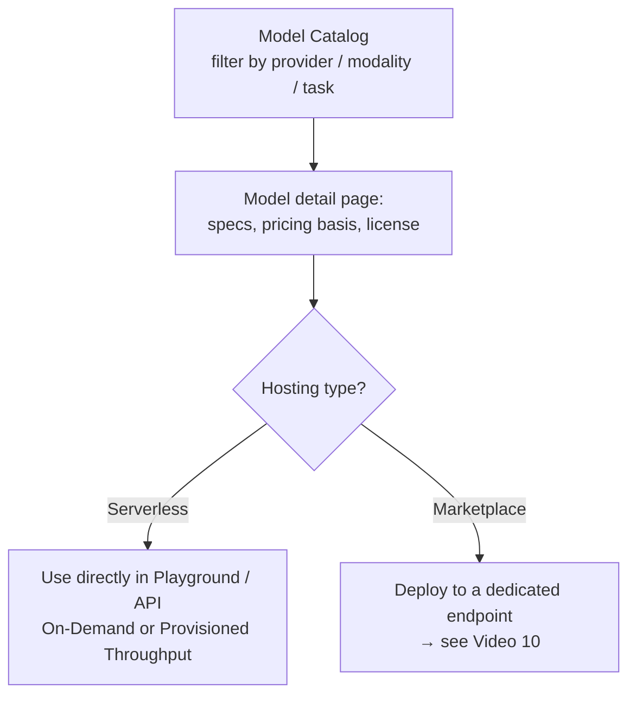

# Amazon Bedrock - Model Catalog Demo

**Playlist position:** #9 of 86
**Category:** Marketplace, Catalog & Deployments
**YouTube:** https://www.youtube.com/watch?v=NUqnT3gqHR8
**Duration:** ~13:35
**Channel:** NamrataHShah

---

## TL;DR
- **Model Catalog** is the single browsing/comparison screen in the Bedrock console for **every** model you can use — both natively **serverless-hosted** models (On-Demand/Provisioned Throughput) and third-party/open-weight models available through **Bedrock Marketplace** on self-managed endpoints.
- You can filter by provider, modality (text/image/embeddings/video), and task, then open a model's detail page for specs, pricing basis, and sample usage before deciding how to consume it.
- It's the discovery layer that feeds into two different consumption paths: call a serverless model directly, or **deploy** a Marketplace model to a dedicated endpoint (see [Video 10](../02-marketplace-deployments-demo/README.md)).

## Detailed Notes

### Why a unified catalog
Before Model Catalog, "models I can call directly" (serverless, pay-per-token) and "models available via Marketplace" (self-hosted endpoints you provision) lived in different parts of the experience. **Model Catalog** unifies discovery: one searchable, filterable list of every model Bedrock can give you access to, regardless of how it's ultimately billed or hosted.

### What you can do in the catalog
- **Filter** by provider (Amazon, Anthropic, Meta, Mistral, Stability, and many more third parties), **modality** (text, image, embeddings, video), and **task** (e.g., summarization, chat, code).
- Open a model's **detail page** to see its description, supported features, context length, supported languages, licensing terms, and — critically — whether it's consumed **serverless** or requires a **Marketplace deployment**.
- Jump straight into the **Playground** to try a serverless model, or into the **deployment flow** for a Marketplace model.

### Serverless vs. Marketplace, at a glance
| | Serverless models | Marketplace models |
|---|---|---|
| Hosting | Fully managed by Bedrock | Deployed to a dedicated, self-managed endpoint (SageMaker-style) |
| Billing | Per-token (On-Demand) or Provisioned Throughput | Per-instance-hour for the endpoint you provision |
| Access | Request model access, then call directly | Subscribe/accept terms, then deploy an endpoint, then invoke |
| Typical fit | Most first-party and many third-party FMs | Specialized / open-weight models not offered serverless |

### Why it matters
Model Catalog is the practical starting point for **model selection** (see also [Video 33/34](../../10-quick-tips/01-select-a-model-for-your-use-case/README.md)) — before picking a model for a use case, you'd browse and compare candidates here rather than hunting across separate pages for serverless vs. Marketplace options.

## Diagram

## Quick Revision Cheat-Sheet

| Concept | One-line takeaway |
|---|---|
| Model Catalog | Single screen to browse & compare every model Bedrock offers |
| Filters | Provider, modality, task |
| Model detail page | Specs, pricing basis, license, hosting type |
| Serverless models | Pay-per-token, call directly, no endpoint to manage |
| Marketplace models | Deploy to a dedicated endpoint, billed per instance-hour |

## Interview Q&A

**Q: What's the difference between a model you can call serverlessly and one you "deploy" from Model Catalog?**
A: Serverless models are fully hosted by Bedrock and billed per token (or via Provisioned Throughput) — you just call the API. Marketplace models require you to deploy them to a dedicated, self-managed endpoint that you provision and pay for by instance-hour, similar to a SageMaker real-time endpoint.

**Q: Why would a model only be available via Marketplace and not serverless?**
A: Typically because it's a specialized or open-weight model that AWS doesn't host as a multi-tenant serverless offering — Marketplace lets you still consume it inside Bedrock's unified API/tooling, but on infrastructure dedicated to you.

**Q: What would you check on a model's detail page before choosing it for a use case?**
A: Modality/task fit, context length, supported languages, hosting type (serverless vs. Marketplace) and its pricing implications, and licensing terms.

## References
No official AWS doc link was given in this video's description — see the [Model Catalog section of the AWS Bedrock console](https://console.aws.amazon.com/bedrock/) and [Video 10](../02-marketplace-deployments-demo/README.md) for the deployment flow.

## Status / Navigation
- ⬅️ Previous: [Travel Agent using Amazon Nova](../../02-hands-on-labs/05-travel-agent-nova/README.md)
- ➡️ Next: [Marketplace deployments Demo](../02-marketplace-deployments-demo/README.md)

---
_Part of [AWS Bedrock Learnings](../../README.md)._
