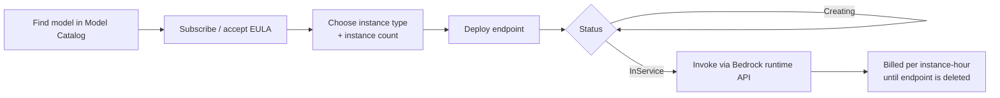

# Amazon Bedrock - Marketplace deployments Demo

**Playlist position:** #10 of 86
**Category:** Marketplace, Catalog & Deployments
**YouTube:** https://www.youtube.com/watch?v=cq5gp7GTClg
**Duration:** ~21:43
**Channel:** NamrataHShah

---

## TL;DR
- **Bedrock Marketplace** lets you deploy models that aren't offered serverless (often specialized or open-weight models) onto a **dedicated, self-managed endpoint** you provision — similar in spirit to a SageMaker real-time endpoint.
- The flow is: find the model in **Model Catalog** → accept its subscription/EULA terms → choose instance type & instance count → deploy → wait for the endpoint to become `InService` → invoke it through Bedrock's runtime APIs.
- Unlike serverless (pay-per-token) models, Marketplace deployments are billed **per instance-hour** for as long as the endpoint is running — so you need to actively **delete/scale down** endpoints you're not using to avoid ongoing charges.

## Detailed Notes

### What a Marketplace deployment actually is
When a model isn't available as a serverless, multi-tenant Bedrock offering, you can still access it through Bedrock by **deploying it to dedicated compute** — Bedrock provisions a managed real-time inference endpoint (conceptually like a SageMaker endpoint) running that model just for you. You pick the hardware; Bedrock handles the deployment mechanics and gives you an endpoint you call through the same family of Bedrock APIs.

### The deployment workflow
1. Find a Marketplace-only model in **Model Catalog** ([Video 9](../01-model-catalog-demo/README.md)) and open its detail page.
2. **Subscribe** — review and accept the model's terms/EULA (and any marketplace pricing disclosures).
3. **Configure the endpoint** — choose an **instance type** (GPU family/size appropriate to the model) and **initial instance count**.
4. **Deploy** — Bedrock provisions the endpoint; this takes time (spinning up real compute), and the endpoint moves through a status (e.g., *Creating → InService*).
5. **Invoke** — once `InService`, you call the model via Bedrock's runtime using the endpoint's identifier, the same general calling pattern as a serverless model.
6. **Manage** — monitor the endpoint's status/health from the console; **delete it** when you're done to stop paying for idle capacity.

### Billing model — why it's different
Marketplace deployments are billed for the **underlying compute** (instance-hours), not per-token — you're paying for dedicated capacity whether or not you're actively sending requests, just like any other real-time ML hosting endpoint. This makes Marketplace deployments a better fit for **steady, predictable traffic** against a specialized model than for sporadic/experimental usage, where serverless On-Demand pricing is more economical.

### Why it matters
This is the practical counterpart to Model Catalog's discovery experience: Catalog tells you *what's available*; this lab shows *how you actually get a Marketplace-only model running* and what it costs to keep it running.

## Diagram

## Quick Revision Cheat-Sheet

| Step | What happens |
|---|---|
| Subscribe | Accept the model's terms/EULA in Marketplace |
| Configure | Pick instance type + instance count |
| Deploy | Bedrock provisions a dedicated real-time endpoint |
| InService | Endpoint is ready to be invoked |
| Invoke | Call it via Bedrock runtime, like any other model |
| Billing | Per instance-hour, while the endpoint exists — delete when idle |

## Interview Q&A

**Q: How does billing differ between a serverless Bedrock model and a Marketplace deployment?**
A: Serverless models are billed per token (On-Demand) or via Provisioned Throughput. Marketplace deployments are billed per instance-hour for the dedicated endpoint you provisioned, regardless of how much you actually invoke it — so idle endpoints still cost money until deleted.

**Q: What steps are required before you can invoke a Marketplace model?**
A: Subscribe to it (accept its terms/EULA), configure and deploy a dedicated endpoint (instance type + count), and wait for it to reach an `InService` status before calling it.

**Q: Why would someone choose a Marketplace deployment over waiting for serverless support?**
A: To access a specialized or open-weight model immediately, with dedicated/predictable capacity for steady traffic — at the cost of managing (and paying for) that capacity yourself instead of pay-per-token convenience.

**Q: What's a common cost pitfall with Marketplace deployments?**
A: Forgetting to delete or scale down an endpoint after testing — since billing is per instance-hour, an idle endpoint keeps accruing cost until it's explicitly removed.

## References
No official AWS doc link was given in this video's description — see [Video 9's Model Catalog notes](../01-model-catalog-demo/README.md) for how to find Marketplace-eligible models, and the AWS Bedrock console's **Marketplace deployments** page for the live workflow.

## Status / Navigation
- ⬅️ Previous: [Model Catalog Demo](../01-model-catalog-demo/README.md)
- ➡️ Next: [Prompt Management Demo](../../03-prompt-management/02-prompt-management-demo/README.md)

---
_Part of [AWS Bedrock Learnings](../../README.md)._
