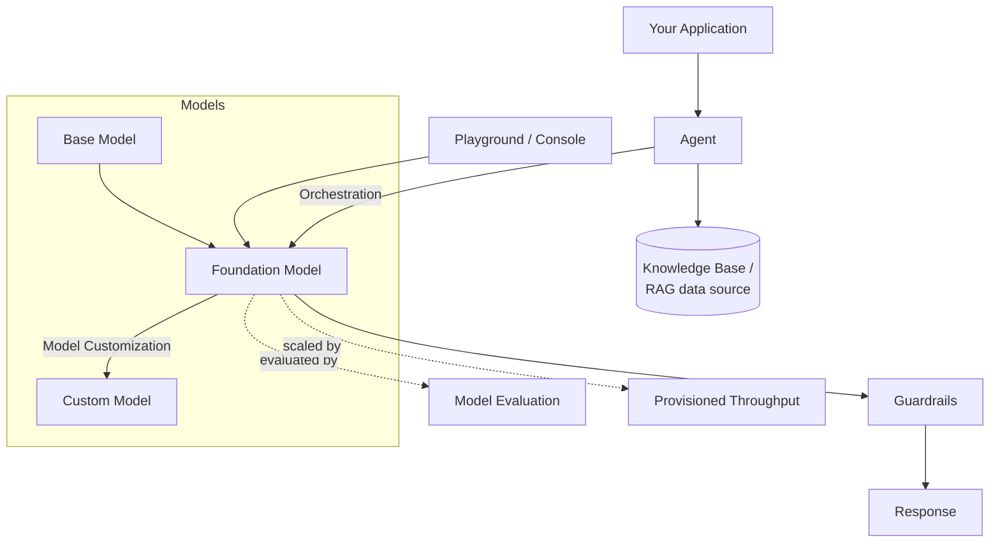

# 🧠 AWS Bedrock Learnings

A structured, revision-ready notes repo built while following **[NamrataHShah's Amazon Bedrock playlist](https://www.youtube.com/playlist?list=PLrDJzKfz9AUsuEdt8PeH4zzg7zmDgJH4s)** (86 videos) on YouTube — concept tutorials, hands-on labs, and the full AgentCore deep-dive series.

> 🎯 **Goal:** not just raw transcripts — concise + detailed notes, Mermaid diagrams, quick-revision cheat-sheets, and interview Q&A for every video, so this repo doubles as interview prep.
>
> 🏗️ **How it's built:** one video at a time, as each one is actually watched. Folders for every video already exist (see roadmap below) so the structure mirrors the full playlist from day one — they're filled in progressively, never backfilled with guesses.

🔗 **Interactive demos hub (Vercel):** _add your deployed URL here after connecting the repo in Vercel_ · 📺 **[Original playlist](https://www.youtube.com/playlist?list=PLrDJzKfz9AUsuEdt8PeH4zzg7zmDgJH4s)**

---

## How Amazon Bedrock fits together



## Quick links
- 📘 [Video-notes template](templates/video-notes-template.md) — the structure every video's README follows
- 🖥️ [Interactive demos](docs/index.html) — flip-cards, animations, step-throughs per topic
- ✅ Progress: **1 / 86** videos fully noted

---

## Roadmap & Progress

Legend: ✅ done · 🔜 not yet covered

### 🎓 Tutorials & Overviews
| # | Video | Status |
|---|---|---|
| 1 | [Terminology](01-tutorials-overview/01-terminology/README.md) | ✅ |
| 2 | [Overview](01-tutorials-overview/02-overview/README.md) | 🔜 |

### 🔬 Hands-on Labs
| # | Video | Status |
|---|---|---|
| 3 | [Chat with your document](02-hands-on-labs/01-chat-with-your-document/README.md) | 🔜 |
| 4 | [Knowledge Bases](02-hands-on-labs/02-knowledge-bases/README.md) | 🔜 |
| 5 | [Guardrails](02-hands-on-labs/03-guardrails/README.md) | 🔜 |
| 6 | [Watermark detection](02-hands-on-labs/04-watermark-detection/README.md) | 🔜 |
| 8 | [Travel Agent using Amazon Nova](02-hands-on-labs/05-travel-agent-nova/README.md) | 🔜 |
| 12 | [Day trip advisor using Bedrock Flows](02-hands-on-labs/06-day-trip-advisor-bedrock-flows/README.md) | 🔜 |
| 14 | [Batch Inference](02-hands-on-labs/07-batch-inference/README.md) | 🔜 |

### 🧠 Prompt Management
| # | Video | Status |
|---|---|---|
| 7 | [Prompt Routers - Preview](03-prompt-management/01-prompt-routers-preview/README.md) | 🔜 |
| 11 | [Prompt Management Demo](03-prompt-management/02-prompt-management-demo/README.md) | 🔜 |
| 13 | [Prompt Caching](03-prompt-management/03-prompt-caching/README.md) | 🔜 |

### 🛒 Marketplace, Catalog & Deployments
| # | Video | Status |
|---|---|---|
| 9 | [Model Catalog Demo](04-marketplace-catalog/01-model-catalog-demo/README.md) | 🔜 |
| 10 | [Marketplace Deployments Demo](04-marketplace-catalog/02-marketplace-deployments-demo/README.md) | 🔜 |

### 📊 Evaluations
| # | Video | Status |
|---|---|---|
| 15 | [Evaluations - Overview](05-evaluations/01-overview/README.md) | 🔜 |
| 16 | [Using Built-in Prompt Dataset](05-evaluations/02-built-in-prompt-dataset/README.md) | 🔜 |
| 17 | [Model as a Judge](05-evaluations/03-model-as-a-judge/README.md) | 🔜 |
| 18 | [Bring Your Own Team](05-evaluations/04-bring-your-own-team/README.md) | 🔜 |
| 19 | [AWS Managed Work Team](05-evaluations/05-aws-managed-work-team/README.md) | 🔜 |

### 📦 RAG Evaluations
| # | Video | Status |
|---|---|---|
| 20 | [Retrieval Only](06-rag-evaluations/01-retrieval-only/README.md) | 🔜 |
| 21 | [Retrieval + Response Generation](06-rag-evaluations/02-retrieval-and-response-generation/README.md) | 🔜 |

### ⚙️ Data Automation (BDA)
| # | Video | Status |
|---|---|---|
| 22 | [Overview](07-data-automation-bda/01-overview/README.md) | 🔜 |
| 23 | [Standard Output - All Modalities](07-data-automation-bda/02-standard-output-all-modalities/README.md) | 🔜 |
| 24 | [Create Custom Blueprint with AI](07-data-automation-bda/03-custom-blueprint-with-ai/README.md) | 🔜 |
| 25 | [Custom Output - Image Modality](07-data-automation-bda/04-custom-output-image-modality/README.md) | 🔜 |
| 26 | [Custom Output - Document Modality](07-data-automation-bda/05-custom-output-document-modality/README.md) | 🔜 |

### 🤖 Multi-Agent Collaboration
| # | Video | Status |
|---|---|---|
| 27 | [Social Media Post Generator](08-multi-agent-collaboration/01-social-media-post-generator/README.md) | 🔜 |
| 28 | [Multilingual Translator](08-multi-agent-collaboration/02-multilingual-translator/README.md) | 🔜 |

### 🧬 Model Customization
| # | Video | Status |
|---|---|---|
| 29 | [Overview](09-model-customization/01-overview/README.md) | 🔜 |
| 30 | [Model Distillation using Synthetic Data](09-model-customization/02-model-distillation-synthetic-data/README.md) | 🔜 |
| 31 | [Fine-Tuning using Labelled Data](09-model-customization/03-fine-tuning-labelled-data/README.md) | 🔜 |
| 32 | [Continued Pre-training using Unlabeled Data](09-model-customization/04-continued-pretraining-unlabeled-data/README.md) | 🔜 |

### ⚡ Quick Tips
| # | Video | Status |
|---|---|---|
| 33 | [How to Select a Model for Your Use Case](10-quick-tips/01-select-a-model-for-your-use-case/README.md) | 🔜 |
| 34 | [How to Select a Model for Your Use Case (full)](10-quick-tips/02-select-a-model-for-your-use-case-full/README.md) | 🔜 |
| 35 | [Models Use Cases and Regional Availability](10-quick-tips/03-model-use-cases-regional-availability/README.md) | 🔜 |

### 🧩 AgentCore (Parts 1–51)
<details>
<summary>Expand all 51 parts</summary>

| # | Video | Status |
|---|---|---|
| 36 | [Part 1 — Overview](11-agentcore/part-01-overview/README.md) | 🔜 |
| 37 | [Part 2 — Inside the Runtime (Deep Dive)](11-agentcore/part-02-inside-the-runtime/README.md) | 🔜 |
| 38 | [Part 3 — Deploy and Invoke Agents on EC2](11-agentcore/part-03-deploy-invoke-agents-ec2/README.md) | 🔜 |
| 39 | [Part 4 — Deploy an LLM Agent](11-agentcore/part-04-deploy-llm-agent/README.md) | 🔜 |
| 40 | [Part 5 — Deploy an Ephemeral (Session) Memory Agent](11-agentcore/part-05-ephemeral-session-memory-agent/README.md) | 🔜 |
| 41 | [Part 6 — Build Chat Client for an Ephemeral Agent](11-agentcore/part-06-chat-client-ephemeral-agent/README.md) | 🔜 |
| 42 | [Part 7 — Inside the Memory (Deep Dive)](11-agentcore/part-07-inside-the-memory/README.md) | 🔜 |
| 43 | [Part 8 — Short-term Memory Agent](11-agentcore/part-08-short-term-memory-agent/README.md) | 🔜 |
| 44 | [Part 9 — LTM Agent with Built-In Strategies](11-agentcore/part-09-ltm-agent-built-in-strategies/README.md) | 🔜 |
| 45 | [Fragrance Lab (Zenith Voyage) — re:Invent 2025](12-special-sessions/01-fragrance-lab-reinvent-2025/README.md) | 🔜 |
| 46 | [Part 10 — Built-In Strategy Override: Semantic](11-agentcore/part-10-strategy-override-semantic/README.md) | 🔜 |
| 47 | [Part 11 — LTM with Self-Managed Strategy (S3 & SNS)](11-agentcore/part-11-ltm-self-managed-s3-sns/README.md) | 🔜 |
| 48 | [Part 12 — Episodic Memory Strategy Overview](11-agentcore/part-12-episodic-memory-overview/README.md) | 🔜 |
| 49 | [Part 13 — LTM with Built-In Episodic Strategy](11-agentcore/part-13-ltm-built-in-episodic-strategy/README.md) | 🔜 |
| 50 | [Part 14 — Gateway Deep Dive](11-agentcore/part-14-gateway-deep-dive/README.md) | 🔜 |
| 51 | [Part 15 — Gateway Calling a Lambda Tool](11-agentcore/part-15-gateway-calling-lambda-tool/README.md) | 🔜 |
| 52 | [Part 16 — Docker-Based Agent with OAuth Gateway & Lambda Tool](11-agentcore/part-16-docker-agent-oauth-gateway-lambda/README.md) | 🔜 |
| 53 | [Part 17 — Calling a Docker Agent from a Python Client](11-agentcore/part-17-calling-docker-agent-python-client/README.md) | 🔜 |
| 54 | [Part 18 — Real-Time Dynamic Weather Agent (Docker, Gateway, OAuth)](11-agentcore/part-18-realtime-weather-agent-docker-gateway-oauth/README.md) | 🔜 |
| 55 | [Part 19 — Multi-Tool Gateway (REST API, Slack, Lambda)](11-agentcore/part-19-multi-tool-gateway-rest-slack-lambda/README.md) | 🔜 |
| 56 | [Part 20 — Orchestrating Enterprise AI Agent Multi-Tool Gateway & Client Integration](11-agentcore/part-20-orchestrating-enterprise-agent-gateway-client/README.md) | 🔜 |
| 57 | [Part 21 — Identity Deep Dive](11-agentcore/part-21-identity-deep-dive/README.md) | 🔜 |
| 58 | [Part 22 — Identity-Governed AI Research Assistant](11-agentcore/part-22-identity-governed-research-assistant/README.md) | 🔜 |
| 59 | [Part 23 — Built-in Tools (Deep Dive)](11-agentcore/part-23-built-in-tools-deep-dive/README.md) | 🔜 |
| 60 | [Part 24 — Code Interpreter](11-agentcore/part-24-code-interpreter-ai-agent/README.md) | 🔜 |
| 61 | [Part 25 — AI Revenue Intelligence Agent](11-agentcore/part-25-revenue-intelligence-agent/README.md) | 🔜 |
| 62 | [Part 26 — AI Market Intelligence Agent with Browser Tool](11-agentcore/part-26-market-intelligence-agent-browser-tool/README.md) | 🔜 |
| 63 | [Part 27 — Live Form Automation (Playwright)](11-agentcore/part-27-live-form-automation-playwright/README.md) | 🔜 |
| 64 | [Part 28 — Inside Observability (Deep Dive)](11-agentcore/part-28-inside-observability-deep-dive/README.md) | 🔜 |
| 65 | [Part 29 — Built-In OOTB Observability](11-agentcore/part-29-built-in-observability/README.md) | 🔜 |
| 66 | [Part 30 — Monitoring Market Intelligence Agent with ADOT](11-agentcore/part-30-monitoring-market-intelligence-agent-adot/README.md) | 🔜 |
| 67 | [Part 31 — Policy](11-agentcore/part-31-policy/README.md) | 🔜 |
| 68 | [Part 32 — Gateway Policy Enforcement](11-agentcore/part-32-gateway-policy-enforcement/README.md) | 🔜 |
| 69 | [Part 33 — Policy Enforcement for Multi-tool Gateway](11-agentcore/part-33-policy-enforcement-multi-tool-gateway/README.md) | 🔜 |
| 70 | [Part 34 — Inside Evaluations (Deep Dive)](11-agentcore/part-34-inside-evaluations-deep-dive/README.md) | 🔜 |
| 71 | [Part 35 — Built-in Evaluators Demo](11-agentcore/part-35-built-in-evaluators-demo/README.md) | 🔜 |
| 72 | [Part 37 — Batch Evaluations](11-agentcore/part-37-batch-evaluations/README.md) | 🔜 |
| 73 | [Part 38 — Custom Evaluator Model-as-judge](11-agentcore/part-38-custom-evaluator-model-as-judge/README.md) | 🔜 |
| 74 | [Part 39 — Custom Evaluators Custom Code](11-agentcore/part-39-custom-evaluators-custom-code/README.md) | 🔜 |
| 75 | [Part 40 — Inside Payments (x402 Protocol)](11-agentcore/part-40-inside-payments-x402-protocol/README.md) | 🔜 |
| 76 | [Part 41 — Payments Infrastructure Setup](11-agentcore/part-41-payments-infrastructure-setup/README.md) | 🔜 |
| 77 | [Part 42 — Payments, Agent and Gateway](11-agentcore/part-42-payments-agent-and-gateway/README.md) | 🔜 |
| 78 | [Part 43 — Command-Line Interface (CLI)](11-agentcore/part-43-command-line-interface-cli/README.md) | 🔜 |
| 79 | [Part 44 — CLI Installation and Current Limitations](11-agentcore/part-44-cli-installation-limitations/README.md) | 🔜 |
| 80 | [Part 45 — Registry (Retired) to AWS Agent Registry (GA)](11-agentcore/part-45-registry-retired-to-agent-registry-ga/README.md) | 🔜 |
| 81 | [Part 46 — Create Your First Registry & Publish an MCP Server Record](11-agentcore/part-46-create-first-registry-publish-mcp-record/README.md) | 🔜 |
| 82 | [Part 47 — Programmatic Registry Discovery (AWS SDK + MCP)](11-agentcore/part-47-programmatic-registry-discovery-sdk-mcp/README.md) | 🔜 |
| 83 | [Part 48 — HITL Agent Execution After Registry Discovery](11-agentcore/part-48-hitl-agent-execution-after-discovery/README.md) | 🔜 |
| 84 | [Part 49 — Inside Harness (Deep Dive)](11-agentcore/part-49-inside-harness-deep-dive/README.md) | 🔜 |
| 85 | [Part 50 — Deploying CloudBuddy on AgentCore Runtime Using Harness](11-agentcore/part-50-deploying-cloudbuddy-on-agentcore-runtime/README.md) | 🔜 |
| 86 | [Part 51 — Harness: Unleashing Built-In Tools for AI Ops](11-agentcore/part-51-harness-built-in-tools-ai-ops/README.md) | 🔜 |

</details>

---

## Repo structure

```
AWS-Bedrock-Learnings/
├── README.md                    # you are here
├── templates/                   # standard note-taking template
├── docs/                        # GitHub Pages — interactive demos
├── 01-tutorials-overview/
├── 02-hands-on-labs/
├── 03-prompt-management/
├── 04-marketplace-catalog/
├── 05-evaluations/
├── 06-rag-evaluations/
├── 07-data-automation-bda/
├── 08-multi-agent-collaboration/
├── 09-model-customization/
├── 10-quick-tips/
├── 11-agentcore/                # Parts 1–51
└── 12-special-sessions/
```

Every video gets its own folder with a `README.md` following the [template](templates/video-notes-template.md): TL;DR → Detailed Notes → Diagrams → Quick Revision Cheat-Sheet → Interview Q&A → References.

## Credits
All source content is from **[NamrataHShah](https://www.youtube.com/@NamrataHShah)**'s Amazon Bedrock YouTube playlist. These are original notes/summaries derived while learning from that series — go watch the original videos!
