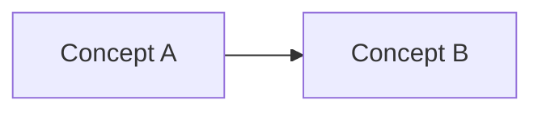

# <Video Title>

**Playlist position:** #<N> of 86
**Category:** <Category>
**YouTube:** <link>
**Duration:** <mm:ss>

---

## TL;DR
- 3–5 bullets, the "if you only read one section" summary.

## Detailed Notes
Full concept breakdown. For concept videos: definitions, how things relate, why they matter.
For hands-on labs: console/CLI steps in order, gotchas, screenshots-in-words.

## Diagram(s)

## Quick Revision Cheat-Sheet
| Term / Step | One-line takeaway |
|---|---|
| | |

## Interview Q&A
**Q: ...?**
A: ...

## References
- Official AWS docs link(s)
- [Interactive demo](../../docs/<slug>/index.html) (if one exists)

## Status / Navigation
- ⬅️ Previous: <link>
- ➡️ Next: <link>

---
_Part of [AWS Bedrock Learnings](../../README.md)._
